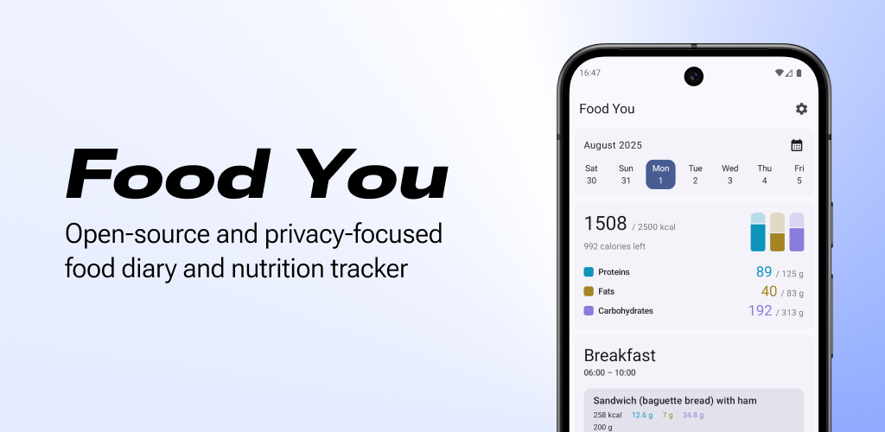
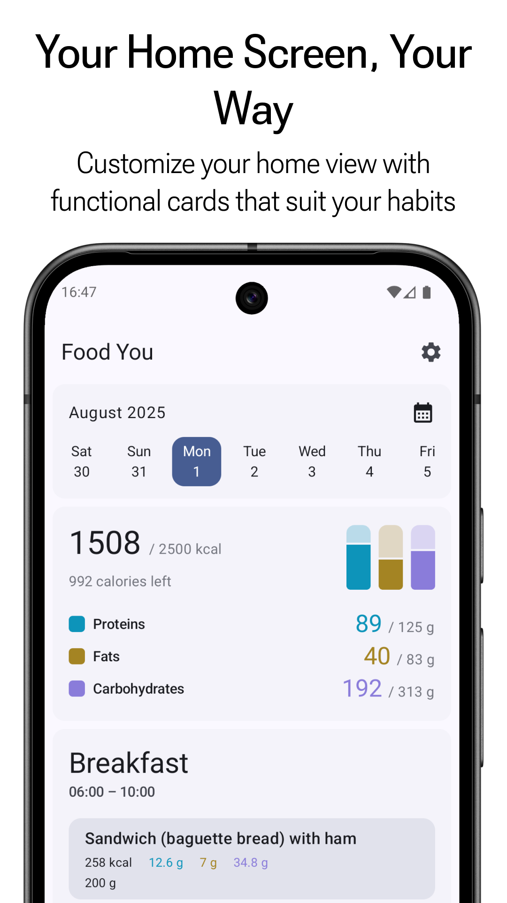
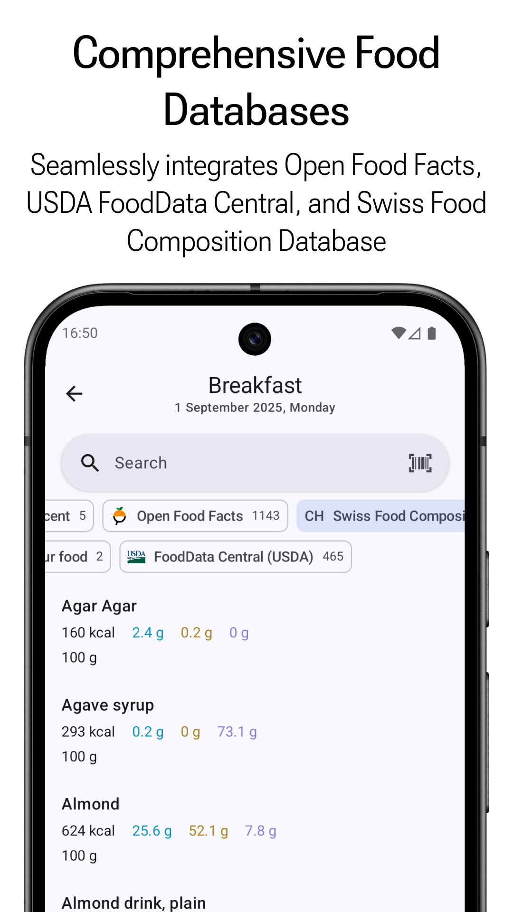
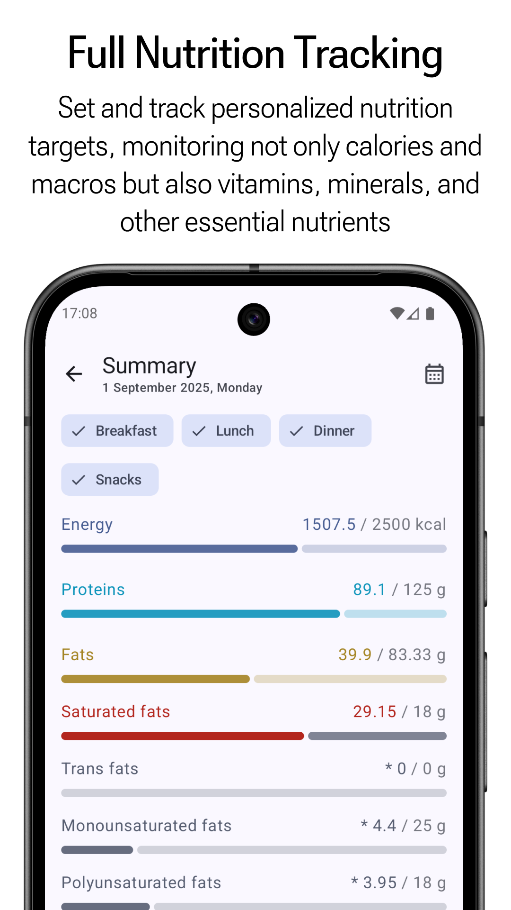
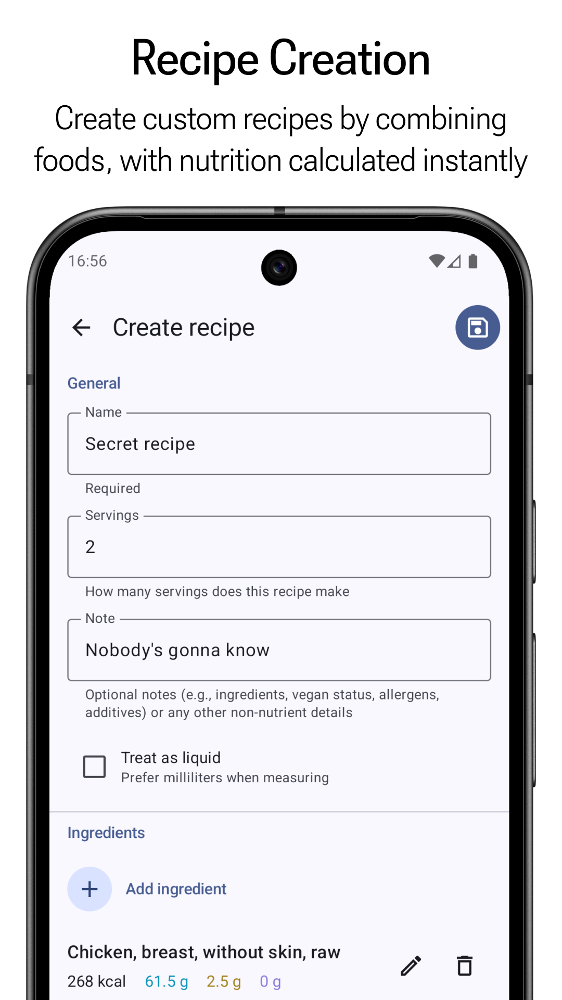

    

**Food You** is a free, open-source, and privacy-focused food diary and nutrition tracker built
using [Material Design](https://m3.material.io/) principles.

## ✨ Features

 

  
  
  
  

 

- 🔒 **Privacy First** – No account required, all data stored locally on your device
- 🧩 **Modular Home Screen** – Customize your home view with functional cards that suit your habits
- 📚 **Comprehensive Food Databases** – Seamlessly integrates Open Food Facts, USDA FoodData Central,
  and Swiss Food Composition Database
- 🧪 **Full Nutrition Tracking** – Set and track personalized nutrition targets, monitoring not only
  calories and macros but also vitamins, minerals, and other essential nutrients
- 🍲 **Recipe Creation** – Create custom recipes by combining foods, with nutrition calculated
  instantly
- 🎨 **Material You Design** – Adaptive theming and modern UI

## 🤝 Contributing

Want to help make Food You even better? Here are some great ways to contribute:

- 🌍 **Translate the App** – Help improve international accessibility
  via [Crowdin](https://crowdin.com/project/food-you). Let me know if you'd like to credited
- 💡 **Request a Feature** – Got an idea? Open
  a [GitHub issue](https://github.com/maksimowiczm/FoodYou/issues) to suggest a new feature or
  improvement
- 🐞 **Report Bugs** – Found a bug? Submit it
  via [GitHub issue](https://github.com/maksimowiczm/FoodYou/issues) so it can be fixed
- ⭐ **Star the Repository** – If you like the project, give it a star

## ❤️ Sponsor

This app is free, open-source, and ad-free. You directly support full-time development of the
project.

- [Support on Ko-fi](https://ko-fi.com/maksimowiczm)
- **BTC**: `bc1qml4g4jwt6mqq2tsk9u7udhwysmjfknx68taln2`
- **ETH**: `0x7C794aF78235504014cC5c987161b80a803ee514`
- **Monero**:
  `41tP8QxdL5hduxcntGwJD92GJDdCTKDyyGSKofbgdgaLG2uJuqgK7daYymBQuJ1iA48LuiLdfoduFMLk1kdkTRKSC4mHkMY`

## ✉️ Contact

Have questions, feedback, or want to collaborate? Reach out!

- **Email**: [maksimowicz.dev@gmail.com](mailto:maksimowicz.dev@gmail.com?subject=Food%20You)
- **Discord**: https://discord.gg/MuF6VZjufn

## 🔄 Similar Open-Source Apps

Looking for alternatives or similar tools?

- [OpenNutriTracker](https://github.com/simonoppowa/OpenNutriTracker)
- [Energize](https://codeberg.org/epinez/Energize)
- [FitBook](https://github.com/brandonp2412/FitBook)
- [Waistline](https://github.com/davidhealey/waistline)

## 💡 Credits

- [ReadYou](https://github.com/Ashinch/ReadYou) — I shamelessly borrowed inspiration from this
  project 🙃
- [Icons8](https://icons8.com) — sushi icon 🍣
