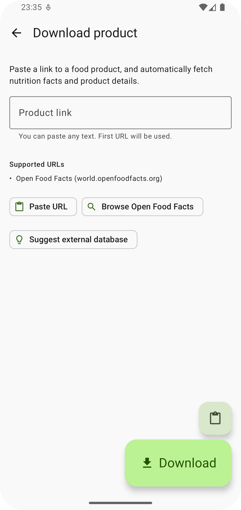

## Food You

**Food You** is a free and open-source food diary and nutrition tracker built
with [Material Design](https://m3.material.io/) principles

---

  
  
  
  
  
  
  
  

---

### ✨ Features

- 🎨 **Material You Design** – Adaptive theming and modern UI
- 📚 **Comprehensive Food Databases** – Integrates Open Food Facts, USDA FoodCentral, and the Swiss
  Food Composition Database
- 🧪 **Full Nutrition Tracking** – Monitor not just calories and macros, but also vitamins, minerals,
  and other nutrients
- 🍲 **Recipe Creation** – Combine multiple foods into custom recipes with automatically calculated
  nutrition
- 🎯 **Daily Goals** – Set and track personalized nutrition targets
- 🧩 **Modular Home Screen** – Customize your home view with functional cards that suit your habits

---

### 📥 Download

---

### 🤝 Contributing

Want to help make Food You even better? Here are some great ways to contribute:

- 🌍 **Translate the App** – Help improve international accessibility
  via [Crowdin](https://crowdin.com/project/food-you). Let me know if you'd like to credited.
- 💡 **Request a Feature** – Got an idea? Open
  a [GitHub issue](https://github.com/maksimowiczm/FoodYou/issues) to suggest a new feature or
  improvement.
- 🐞 **Report or Fix Bugs** – Found a bug? Submit it via GitHub or contribute a fix with a pull
  request.
- 🥫 **Suggest Food Database Integrations** – Know of a public food database worth adding? Let me
  know!

---

### ❤️ Sponsor

This app is free, open-source, and ad-free. You directly support full-time development of the
project.

- [Support on Liberapay](https://liberapay.com/maksimowiczm)
- [Support on Ko-fi](https://ko-fi.com/maksimowiczm)
- **BTC**: `bc1qml4g4jwt6mqq2tsk9u7udhwysmjfknx68taln2`
- **Monero**:
  `41tP8QxdL5hduxcntGwJD92GJDdCTKDyyGSKofbgdgaLG2uJuqgK7daYymBQuJ1iA48LuiLdfoduFMLk1kdkTRKSC4mHkMY`

---

### 🔄 Similar Open-Source Apps

Looking for alternatives or similar tools?

- [OpenNutriTracker](https://github.com/simonoppowa/OpenNutriTracker)
- [Energize](https://codeberg.org/epinez/Energize)
- [FitBook](https://github.com/brandonp2412/FitBook)
- [Waistline](https://github.com/davidhealey/waistline)

---

### 💡 Credits

- [ReadYou](https://github.com/Ashinch/ReadYou) — I shamelessly borrowed inspiration from this
  project 🙃
- [Icons8](https://icons8.com) — sushi icon 🍣

---

### ✉️ Contact

- **Email**: [maksimowicz.dev@gmail.com](mailto:maksimowicz.dev@gmail.com?subject=Food%20You)