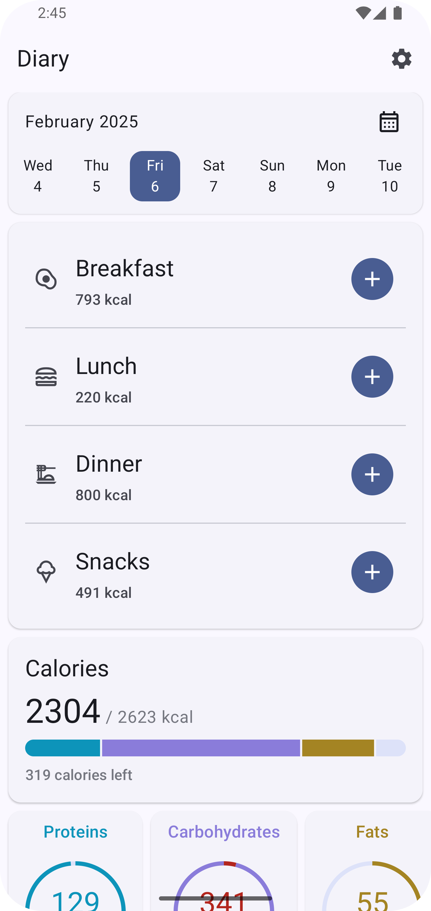
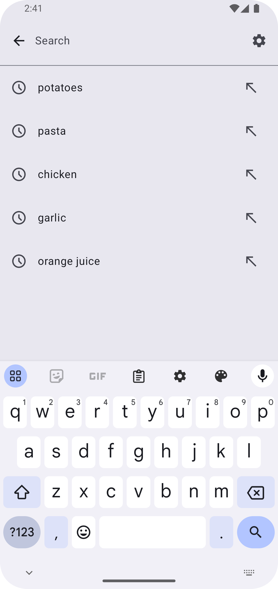
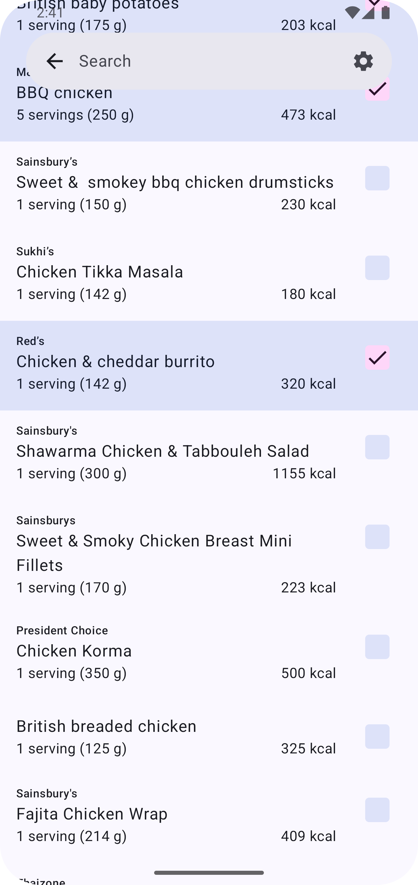
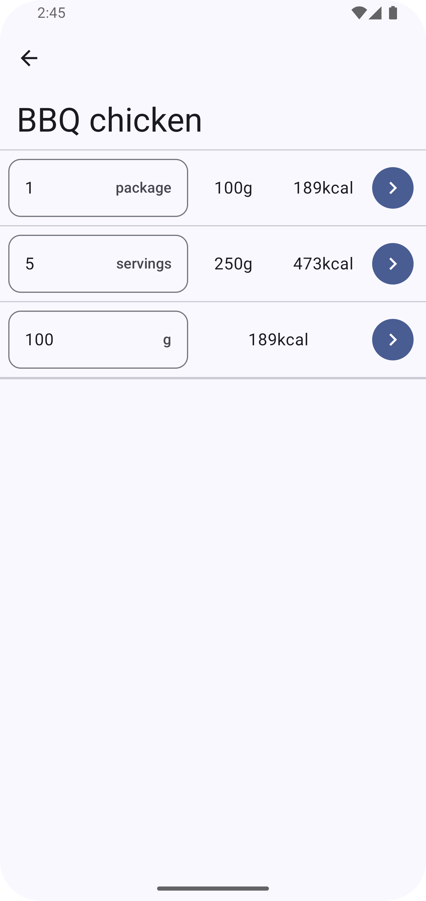
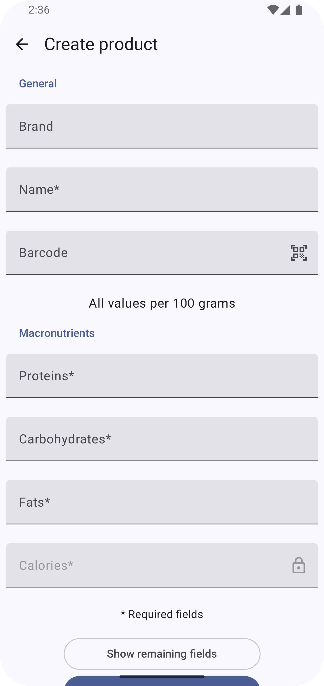
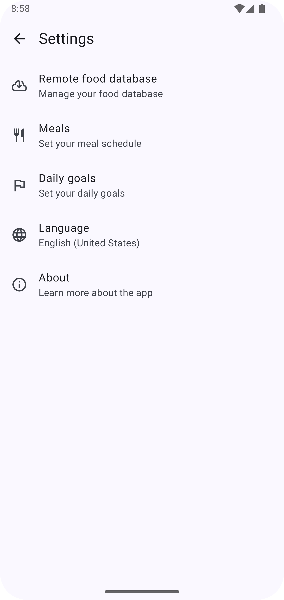
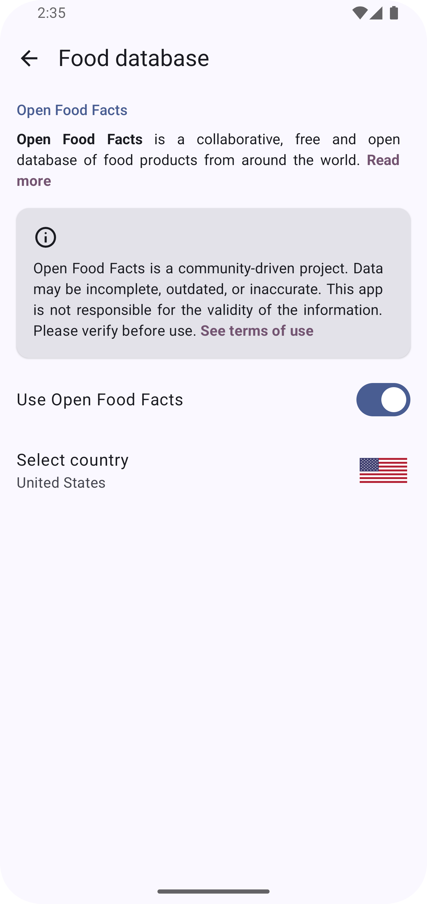
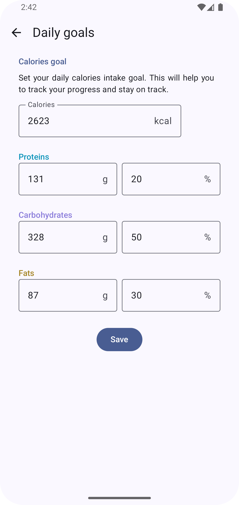

## FoodYou

A free and open-source calorie counter app

 

    
    
    
    
    
    
    
    

 

### 📌 What is this?

**FoodYou** is a simple calorie-tracking app designed with [Material You](https://m3.material.io/)
aesthetic - at least,
that was the goal! Since I’m still learning, I can’t say for sure if it fully embraces the style. 😅

### ❓ Why does it exist?

I wanted a minimal calorie counter that aligns with Material You, so I decided to build one myself!

### ✨ Features

- **Material You Design**: Dynamic theming for a visually cohesive experience.
- **Edge-to-Edge Design**: Utilizes the full screen for a more immersive experience.
- **Interactive Home Page**: Built with cards offering key functionalities.
- **Open Food Facts Integration**: Fetches food data for accurate tracking.
- **Extensible & Open-Source**: Built to be customizable and community-driven.

### 🔄 Similar Apps

If you're looking for alternatives or inspiration, check out these open-source projects:

- [FitBook](https://github.com/brandonp2412/FitBook)
- [Waistline](https://github.com/davidhealey/waistline)

### 🌐 Translations

You can help with translations on [Crowdin](https://crowdin.com/project/food-you)! If you'd like to
be credited for your contributions, please add your name to
the [Languages file](app/src/main/java/com/maksimowiczm/foodyou/feature/settings/language/ui/Languages.kt)
or let me know, and I will add it for you.

### 💡 Credits

- [ReadYou](https://github.com/Ashinch/ReadYou) — I shamelessly borrowed inspiration from this
  project. 🙃
- [Icons8](https://icons8.com) — sushi icon 🍣

---

🔧 *Still a work in progress! Any feedback is welcomed.*
