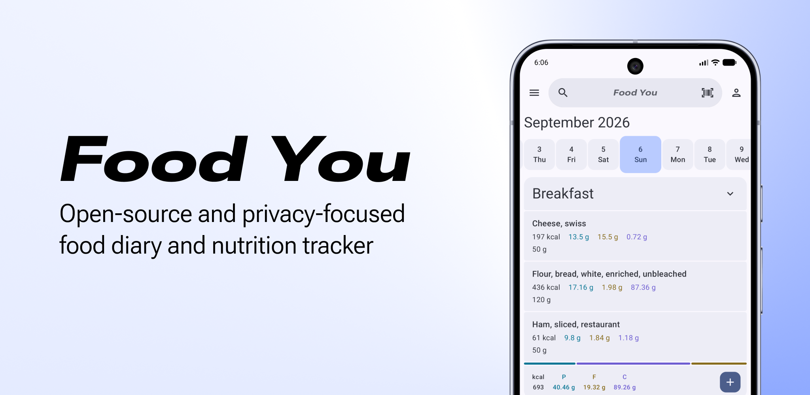
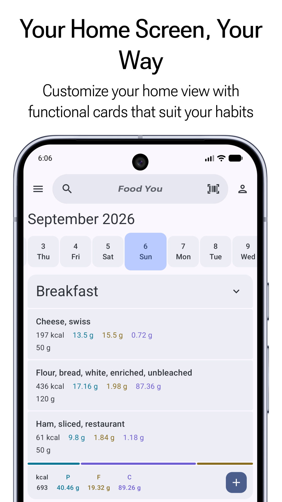
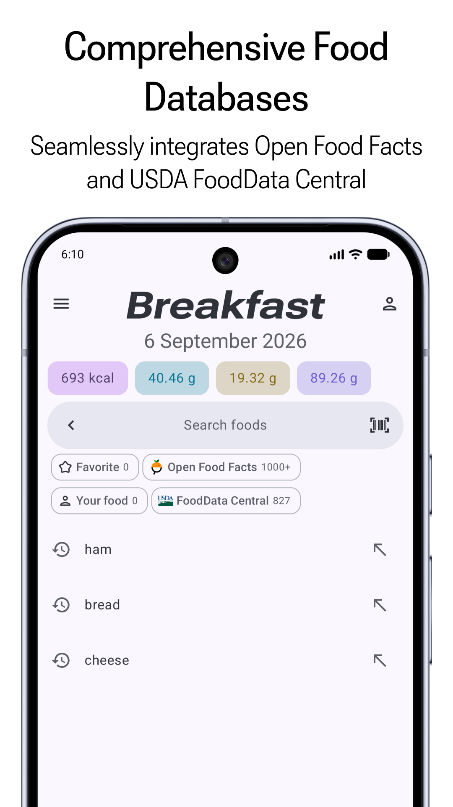
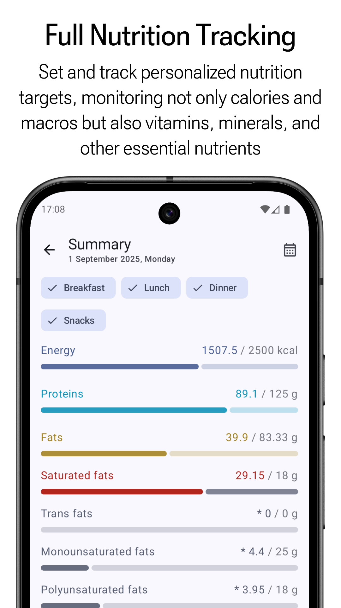
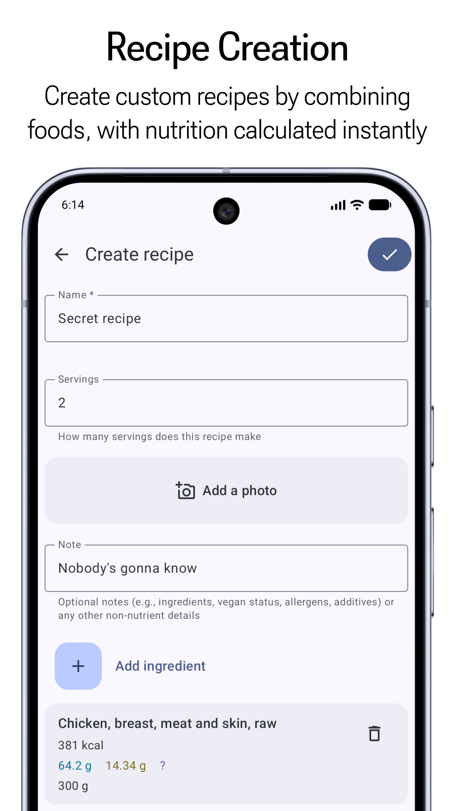

[](https://f-droid.org/en/packages/com.maksimowiczm.foodyou)
[](https://github.com/maksimowiczm/FoodYou/releases/latest/)
[](https://github.com/maksimowiczm/FoodYou/releases/)
[](https://github.com/maksimowiczm/FoodYou/stargazers)

<div align="center">
  
</div>

**Food You** is a free, open-source, and privacy-focused food diary and nutrition tracker built
with [Material Design](https://m3.material.io/) principles.

## Installation

<div align="center">

[](https://f-droid.org/packages/com.maksimowiczm.foodyou)
[](https://github.com/maksimowiczm/FoodYou/releases)

</div>

SHA-256 hash of signing certificate:
`cd74b0aedd8ead8184063a65909d639a8c885cf6465829690a9be83a8904bdea`

The above signature is also valid for the F-Droid, thanks
to [reproducible builds](https://f-droid.org/docs/Reproducible_Builds/)

## Screenshots

<div align="center">
  
  
  
  
</div>

## Goals

Many nutrition apps are built around ads, subscriptions, engagement metrics, or opaque data
collection. They keep adding features to capture more of your attention and turn a simple need into
an increasingly bloated product.

Food You takes the opposite approach. It is a privacy-focused **food diary app** whose primary
purpose is simply to help you keep track of what you eat.

Its core values are:

- **Privacy** — keep personal data local by default and avoid mandatory accounts
- **Modern experience** — fast, clean, and built with Material Design principles
- **Simplicity** — prioritize clarity over feature bloat

Food You is not opposed to new features. However, every addition should have a clear purpose and fit
naturally within the app. Features that add complexity and distract from the core food diary
experience should be carefully evaluated.

## Contributing

- **Star the project** — the easiest way to support the app if you find it useful
- **Translate the app** — help improve accessibility
  via [Crowdin](https://crowdin.com/project/food-you)
- **Report bugs or suggest features** — open an issue
  on [GitHub](https://github.com/maksimowiczm/FoodYou/issues)

Not every feature request will be implemented. As with all contributions, suggestions are evaluated
based on their usefulness, simplicity, and fit with the project's goals.

## Sponsor

If you find app useful, you can support its development. Sponsorship is entirely optional and helps
make continued development possible, but sponsorship does not buy influence over the project or
guarantee that a requested feature will be added.

- [Support on Ko-fi](https://ko-fi.com/maksimowiczm)
- **BTC** `bc1qml4g4jwt6mqq2tsk9u7udhwysmjfknx68taln2`
- **Monero**
  `41eXqs6zg8PFQ8Fec3iyYcVA3rFHc7wgj9hLRuiVh2FtbE2q2TGoCbhSmVX5R76SmYPpSM2VR7qmD4SQ4YMZCEFK6DGGWfB`

## Contact

- [maksimowicz.dev@gmail.com](mailto:maksimowicz.dev@gmail.com?subject=Food%20You)
- https://discord.gg/MuF6VZjufn

## Similar open-source apps

If you are exploring alternatives, these are worth checking out:

- [OpenNutriTracker](https://github.com/simonoppowa/OpenNutriTracker)
- [Energize](https://codeberg.org/epinez/Energize)
- [FitBook](https://github.com/brandonp2412/FitBook)
- [Waistline](https://github.com/davidhealey/waistline)

## License

```
Copyright (C) 2024-2026 Mateusz Maksimowicz

This program is free software: you can redistribute it and/or modify it under the terms of the GNU General Public License as published by the Free Software Foundation, either version 3 of the License, or (at your option) any later version.

This program is distributed in the hope that it will be useful, but WITHOUT ANY WARRANTY; without even the implied warranty of MERCHANTABILITY or FITNESS FOR A PARTICULAR PURPOSE. See the GNU General Public License for more details.

You should have received a copy of the GNU General Public License along with this program. If not, see <https://www.gnu.org/licenses/>.
```